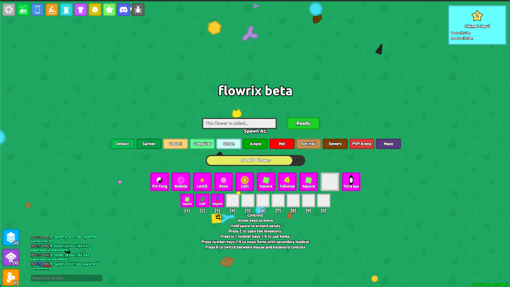

# flowrix 

[florr.io](https://florr.io) clone, written in C++. The web version, which the
public server runs, is the C++ client and server compiled to WebAssembly with
emscripten: the client runs in the browser and the server runs under Node. The
same code also builds natively, as an SDL2 client and a server.

[Public Server](https://florrclone.cryodome.com)

[Discord](https://discord.com/invite/SvAYCGsmAg)

**If the game is blocked at your school, try using
[https://florrclone.cryodome.com:3000](https://florrclone.cryodome.com:3000),
click advanced options and continue to site.**



> **License notice:** As of October 2026 this project is licensed under the
> [GNU Affero General Public License v3.0 or later](LICENSE) (previously GPL v3
> or later, and before that ISC), because it contains code adapted from gardn:
> [trigonal-bacon/gardn](https://github.com/trigonal-bacon/gardn), the original
> project, and [maxnest0x0/gardn](https://github.com/maxnest0x0/gardn), a fork of
> it. Both are AGPL-3.0, and parts of the C++ client are adapted from them,
> including the mob, petal and flower artwork. If you distribute this software
> or a modified version of it, or run a modified version as a network service,
> you must do so under the same license and make the corresponding source code
> available to its users. See [License](#license).

## Play

Online, on the [public server](https://florrclone.cryodome.com).

Offline, from a single file:

```bash
npm run build:offline         # -> dist/offline.html
npm run build:offline:asmjs   # -> dist/offline-asmjs.html, for a browser without WebAssembly
```

`dist/offline.html` is the whole game in one page: the server and the client
compiled into one wasm and embedded in the HTML. Open it straight from disk, with
no server and no network. Your account and progress are kept in that browser's
local storage. The asm.js page is the same game translated to JavaScript, for a
browser that cannot run WebAssembly at all. It is bigger and slower, and its
build takes minutes, so it is only built when you ask for it. Neither page is
committed, so building one needs the [web toolchain](#prerequisites).
`cpp/docs/ARCHITECTURE.md` explains how the offline build works.

## Run a server locally

`dist/` is a committed, ready-built copy of the web version, so this needs only
Node.js (18 or newer):

```bash
npm run start_nobuild
```

This runs `node dist/server.js --port ${PORT:-3000} --db dist/inventory.json
--web-root dist` from the repository root. That starts the game server on
`$PORT` (default 3000), keeps its accounts in `dist/inventory.json`, and serves
the browser client from `dist/` on the same port. The database file is created
on the first save. It is gitignored: never commit it. From `dist/` the server
serves only the web build's own files, never the database next to them, each
with an `ETag` and `Last-Modified`, so a reload of an unchanged build is
answered `304` instead of downloading it again. Open <http://localhost:3000>.

**https and WebTransport.** With no certificate the server speaks plain http,
and the client uses WebSocket. For https, and for WebTransport, which needs
https:

```bash
npm run dev:cert        # needs the openssl command
npm install             # optional: the WebTransport packages
npm run start_nobuild   # now https://localhost:3000
```

`dev:cert` writes a self-signed localhost certificate, `dev-cert.crt` and
`dev-cert.key`, into the repository root. That is the server's working
directory and where it looks for certificates. It checks `cert.crt`/`cert.key`
(a real certificate you installed) first, then the dev pair, and uses the first
one that has not expired. `--cert` and `--key` name a pair explicitly. The dev
certificate expires after 13 days on purpose: only a certificate that
short-lived can be pinned by its hash, which is how WebTransport accepts it
with no trust-store setup. Your browser still asks you to accept it for the
page itself. The server never renews a certificate: when one expires, it only
reports this in its log, so run `npm run dev:cert` again. `npm install` is only
needed for WebTransport: the server has no other npm dependency.

### Making yourself admin

Admin rights come only from the account's `admin` flag in the database, or from
a one-life loan that an account with the flag gives with `/admin grant_admin`.
No name or client setting grants them. On a server you run:

1. Register in game.
2. Stop the server with Ctrl+C (or SIGTERM). It saves the database on its way
   out, so your new account is in the file. Edit the file only while the
   server is stopped: a running server keeps the database in memory and
   overwrites the file each time it saves, at least every 30 seconds.
3. In the database file (`dist/inventory.json` above; `--db` sets its path),
   find your account under `"users"` and add `"admin": true`.
4. Start the server again.

On the offline page, **Grant Admin** in Settings > Advanced sets the flag on
the account the page is signed in to. That page's database editor key is fixed,
and the page says it: the Grant Admin confirmation and `/admin db` both show it.
On any other server the key is printed in the server log at start-up and
nowhere else. The admin tools are in
[cpp/docs/admin-dashboard.md](cpp/docs/admin-dashboard.md).

## Build

### Prerequisites

- **Node.js** 18 or newer, because the server uses Node's built-in `fetch`.
  Prod runs Node 22. The optional WebTransport packages need Node 20 or newer.
- **emscripten**, from the
  [emsdk](https://emscripten.org/docs/getting_started/downloads.html) or
  `brew install emscripten`, with `emcmake` and `emcc` on `PATH`.
- **CMake** 3.16 or newer, and **make**.
- **Network access** the first time each build directory is configured. CMake
  downloads the Ubuntu Bold font and checks it against a pinned hash.
- **macOS or Linux.** The native transport uses POSIX sockets, and the npm
  scripts use POSIX shell syntax.

The web build needs neither SDL2 nor `npm install`. The native build needs a
few more packages ([below](#native)).

### The web version

```bash
npm start       # npm run build, then npm run start_nobuild
npm run build   # the build alone
```

Both commands run `scripts/build-web.js`. It configures `cpp/build-web` with
`emcmake cmake`, builds the client and the server, and copies the outputs into
`dist/`:

- the client: `index.html`, `bundle.js` and `bundle.wasm`
- the server: `server.js` and `server.wasm`
- `favicon.ico`
- deflated `.bin` copies of `bundle.js` and `bundle.wasm`, which the page
  downloads instead of the originals when it can

The game's content is embedded in both wasms, so nothing else needs to be
deployed next to them. `build:web-client` and `build:server` build one half
each, and `build:dev` is the dev-flavour version of `build` (see
[Scripts](#scripts)). Adding `--copy-only` (`npm run build -- --copy-only`)
skips CMake and copies whatever `cpp/build-web` already holds. It is meant for
a machine without emscripten, and it copies a stale build without warning.

There are two flavours. `release` is what ships: `-O3`, with asserts and
emscripten's runtime checks compiled out. `dev` is still optimised, but keeps
asserts, frame pointers and emscripten's checks, and turns off the account
abuse limits. The npm scripts set the flavour (`FLIX_BUILD`) themselves.
Switching flavour deletes `cpp/build-web` first. Otherwise the Makefile
generator would relink the previous flavour's objects into the new build.

### Native

The native build needs a C++17 compiler, CMake, pkg-config and SDL2's
development package. For example, `brew install sdl2 pkg-config` on macOS, or
`sudo apt install build-essential cmake pkg-config libsdl2-dev` on Debian or
Ubuntu.

```bash
cmake -S cpp -B cpp/build      # dev flavour; add -DFLIX_BUILD=release for the shipping one
cmake --build cpp/build -j
```

All the outputs land in `cpp/build`: `flowrix_server`, `flowrix_client`,
`flix_tests` and the tools. CMake also puts the game's content in
`cpp/build/data`, flat: the three files in `data/`, `maps/maps.json` and the
maps it lists with their tilesets and tile art, the title-screen backdrops, and
the font it downloaded. Both programs read their content from `--data`, which
defaults to `data`, so run them from `cpp/build`:

```bash
cd cpp/build
./flowrix_server    # port 3000, accounts in ./inventory.json
./flowrix_client    # connects to 127.0.0.1:3000; --host and --port pick another server
```

The repository's own `data/` is not a complete content directory because it has
no maps, so a server started from the repository root stops with `data/maps.json
is missing`. The native pair talks over length-prefixed TCP, not WebSocket. As a
result the native client plays only against a native server: it cannot join the
public server or the one `npm start` runs, and a browser cannot join a native
server.

## Test

```bash
cpp/build/flix_tests                             # the C++ suite (or: cd cpp/build && ctest)
FLIX_TEST_FILTER=splitter cpp/build/flix_tests   # only the cases whose name contains "splitter"
npm run test:ws                                  # the WebSocket server in dist/server.js
```

`flix_tests` comes with the native build and reads the content in
`cpp/build/data`. It runs every case, including end-to-end ones that run a real
server and real clients over loopback. It reports every failed check instead of
stopping at the first. A filter prints how many cases it picked, and one that
picks none fails the run, so a mistyped filter cannot pass. `test:ws` builds
nothing. It starts the `dist/server.js` that is already there and checks its
WebSocket handshake and framing over raw TCP, so rebuild the server first
(`npm run build:server`) if you changed it.

## Layout

```
cpp/
  client/       the game client: app and HUD, menus and widgets (ui/), world and
                mob rendering (render/), the browser page and its glue (web/)
  server/       the game server: sessions, accounts and the database, chat and
                admin commands, bots, and the simulation's systems (systems/)
  shared/       code both programs link: the ECS and JSON (core/), the wire
                protocol and transports (net/), content loading and game rules (game/)
  offline/      the single-file offline page: server and client in one wasm
  tests/        flix_tests
  tools/        native diagnostic tools: a rasterizer fingerprint, an artwork
                contact sheet, benchmarks, a bot probe, hitbox fitting (each
                file's header explains it)
  cmake/        prune_staged_content.cmake: clears stale files out of a
                build's data/
  docs/         ARCHITECTURE.md, admin-dashboard.md
  third_party/cpp_canvas/
                the vendored Canvas2D-like renderer both clients draw through
data/           mobs.json, petals.json, mob_drops.json: every mob and petal,
                artwork included, and the drop tables
maps/           the world, in Tiled's format (see maps/README.md)
dist/           the committed web build: index.html, bundle.js, bundle.js.bin,
                bundle.wasm, bundle.wasm.bin, server.js, server.wasm, favicon.ico
scripts/        build-web.js (the web build), gen-dev-cert.js (dev:cert),
                ws-conformance.js (test:ws), svg-to-skin.js (svg2skin),
                ctx_capture.js (for html_render.html)
tools/arduino-cpu-matrix/
                an Arduino App that shows the LAN test server's CPU load on
                the board's LED matrix
img/            the images in this README
maps_old/       an archive of the retired map format; nothing reads it
```

The game's content lives in `data/` and `maps/`. CMake copies it into each
build's `data/` directory, and the web build embeds that directory in both
wasms. A content edit therefore reaches the game only after a rebuild, and the
client and server must be rebuilt together (see
[Shipping a change](#shipping-a-change)).

Three standalone files sit at the root:

- `SvgToSkin.html` is the `svg2skin` converter as a page, built on
  `scripts/svg-to-skin.js`. Drop in an SVG, tune the fit, and paste the result
  into the Skin Studio's text editor (Create, then Text editor).
- `html_render.html` draws whatever Canvas2D JavaScript you paste into it.
  `scripts/ctx_capture.js` produces that kind of code: paste it into a page's
  console and it records what the page draws, as canvas commands.
- `mob_stats.json` is a reference table of mob stats: health at every rarity,
  damage and armour. Nothing in the build reads it.

## Shipping a change

`dist/` is committed for two reasons. The in-game `/admin update` command
installs the `dist/` from the `web` branch's zipball, and a fresh clone runs
without a build. The rules follow from that:

- **Build what you commit, from a clean tree.** Run `npm run build` (the release
  build, not `build:dev`) in a tree that holds exactly what you are committing,
  such as a clean checkout or a `git worktree`. The wasms embed whatever the
  tree contains, so an unrelated edit would ship inside them. Commit `dist/` in
  the same commit as the source change.
- **Only build outputs go in `dist/`.** That means the eight files listed
  above, and never `dist/inventory.json`. A `.bin` file always moves with its
  plain file: the page loads the `.bin` first, so a stale one serves an old
  client.
- **Client and server ship together.** When a client connects, the server
  compares two values with its own: `kProtocolVersion`, and a hash of the bytes
  of `mobs.json`, `petals.json`, `mob_drops.json`, `maps.json` and every map
  and tileset it lists. If either differs, the server refuses the client, and
  a browser client reloads once to fetch the build the server is serving. Bump
  `kProtocolVersion` in `cpp/shared/net/protocol.h` whenever a message layout
  changes.
- **Deploying.** On a running server, `/admin update` does the following:
  1. backs up the database to `db_backups/`, one level above the database's
     own directory (`~/db_backups` for a server in `~/dist`), and stops there
     if the snapshot is not on the host's disk. The server prunes only its own
     snapshots (`inventory-<time>-<label>.snapshot.json`) to the newest 30;
     anything else in that directory, such as the older `inventory-*.json`
     snapshots, is listed by `/admin backup_db list` and never deleted
  2. downloads the zipball of the `web` branch of `flowrix-io/florr_clone`
     (`FLORR_UPDATE_REPO`, `FLORR_UPDATE_BRANCH` or `FLORR_UPDATE_URL` point it
     elsewhere)
  3. copies the zipball's `dist/` over the server's directory. It overwrites
     files but never deletes any, and leaves `inventory.json`, `node_modules`,
     `db_backups`, `cert.crt` and `cert.key` alone.
  4. restarts the server, by default a minute after the install so that
     players are warned (`/admin update now` restarts straight away)

  The restart exits with code 1 so that a supervisor such as pm2 or systemd
  starts the new build; a stop by Ctrl+C or SIGTERM exits 0. A server you
  started by hand just stops. Updating needs the `unzip` command on the host,
  and only the Node build can update itself.

## Scripts

| Script | What it does |
| --- | --- |
| `npm start` | `npm run build`, then `npm run start_nobuild` |
| `npm run start_nobuild` | Serve `dist/` as it is: `node dist/server.js --port ${PORT:-3000} --db dist/inventory.json --web-root dist` |
| `npm run build` | Release web build of the client and the server, copied into `dist/` |
| `npm run build:dev` | The same build in the dev flavour; do not commit it |
| `npm run build:web-client` | Release web client only: `index.html`, `bundle.js`, `bundle.wasm`, their `.bin` copies, `favicon.ico` |
| `npm run build:server` | Release web server only: `server.js`, `server.wasm` |
| `npm run build:offline` | The single-file offline page, `dist/offline.html` |
| `npm run build:offline:asmjs` | The same page without WebAssembly, `dist/offline-asmjs.html`; takes minutes |
| `npm run dev:cert` | Write a short-lived localhost certificate, `dev-cert.crt` and `dev-cert.key`, into the repository root (needs openssl) |
| `npm run test:ws` | WebSocket conformance tests against `dist/server.js`; builds nothing |
| `npm run svg2skin -- art.svg` | Convert an SVG into Skin Studio text commands |

## Docs

- [cpp/docs/ARCHITECTURE.md](cpp/docs/ARCHITECTURE.md): how the C++ engine fits
  together, and why.
- [maps/README.md](maps/README.md): making and editing maps in Tiled.
- [cpp/docs/admin-dashboard.md](cpp/docs/admin-dashboard.md): the admin
  dashboard.
- [tools/arduino-cpu-matrix/README.md](tools/arduino-cpu-matrix/README.md): the
  CPU monitor on the Arduino test server's LED matrix.

## The TypeScript version

The C++ version replaced a TypeScript one: a webpack browser client and a Node
server. The TypeScript version was deleted on 2026-10-08, along with its
toolchain and the compiled JavaScript in `dist/`. It is still in git history.
The last commit with the whole TypeScript tree is `d47055a7`, so
`git show d47055a7:src/<path>` reads any of its files.

**Like the game? Star the GitHub repository!**

## License

Copyright (c) 2026 sussybite8888

This program is free software: you can redistribute it and/or modify it under
the terms of the GNU Affero General Public License as published by the Free
Software Foundation, either version 3 of the License, or (at your option) any
later version. See [LICENSE](LICENSE) for the full text.

This program is distributed in the hope that it will be useful, but WITHOUT
ANY WARRANTY; without even the implied warranty of MERCHANTABILITY or FITNESS
FOR A PARTICULAR PURPOSE. See the GNU Affero General Public License for more
details.
